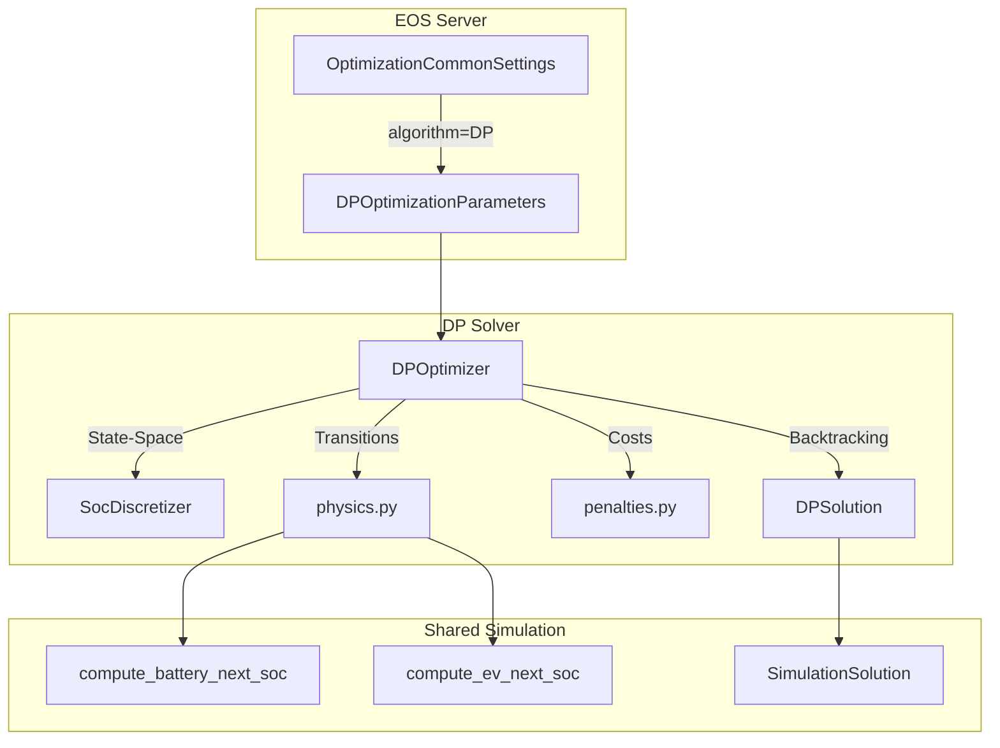

# Dynamic Programming Solver Implementierungsplan

## Überblick

Implementierung eines Dynamic Programming (DP) Solvers für das EOS Energy Optimization System als Alternative zum bestehenden genetischen Algorithmus (GA). Der DP-Solver findet die global optimale Lösung durch systematische Exploration des State-Space.

## Architektur



## DP-Formulierung

### State-Space

Der DP-State besteht aus:

```
State = (hour, battery_soc_index, ev_soc_index, appliance_started_flag)
```

- `hour`: 0 bis `prediction_hours` (48 Std.)
- `battery_soc_index`: 0 bis 50 (2% SoC-Schritte, 51 diskrete Werte)
- `ev_soc_index`: 0 bis 50 (falls EV konfiguriert, sonst ignoriert)
- `appliance_started_flag`: 0 oder 1 (falls Home-Appliance konfiguriert)

**State-Space-Größe (worst case):**
- 48 Stunden × 51 Bat-SoC × 51 EV-SoC × 2 Appliance = ~2.5 Millionen States
- In der Praxis deutlich weniger durch Constraints (min/max SoC, EV nur nach Hausekomst)

### Action-Space

Pro State sind folgende Aktionen möglich:

```
Action = (ac_charge_level, dc_charge_allowed, discharge_allowed, ev_charge_level)
```

- `ac_charge_level`: Index in `bat_possible_charge_values` (z.B. [0.1, 0.5, 1.0] aus Config) oder 0 (kein AC-Laden) → **Feature 1: Battery AC Charge Rates**
- `dc_charge_allowed`: 0 oder 1 (PV-Ladung erlauben), falls `optimize_dc_charge=True`; sonst immer 1 → **Feature 3: DC Charge Optimization Flag**
- `discharge_allowed`: 0 oder 1 (Entladung erlauben)
- `ev_charge_level`: Index in `ev_possible_charge_values` (z.B. [0.0, 0.1, ..., 1.0]) → **Feature 2: EV Charge Rates**

**Maximale Aktionen pro State:** N_bat_rates × 2 × 2 × N_ev_rates (typisch 12-48)

### GA-Paritäts-Features

Der DP-Solver implementiert folgende Features für Parität zum GA:

1. **Battery AC Charge Rates**: Nutzt konfigurierbare Levels aus `pv_battery.charge_rates` oder `config.devices.batteries[0].charge_rates`. Default: [1.0].

2. **EV Charge Rates**: Nutzt konfigurierbare EV-Laderaten aus `ev.charge_rates` oder `config.devices.electric_vehicles[0].charge_rates`. Default: [0.0, 0.1, ..., 1.0].

3. **DC Charge Optimization Flag**: `optimize_dc_charge` bestimmt ob DC-Laden als DP-Entscheidung (0/1) oder immer aktiv ist. Default: False (wie GA).

4. **Visualization**: DP ruft `prepare_visualize()` auf, identisch zum GA. Ausgabe: PDF mit AC-Charge, DC-Charge, Discharge, EV-Charge, SoC-Trajektorien.

5. **Worst-Case Mode**: `worst_case=True` invertiert die Gesamtbilanz (wie GA), für pessimistische Szenarien.

6. **EV Optimierung nur wenn nötig**: EV wird nur optimiert wenn `ev.min_soc_percentage >= ev.initial_soc_percentage` (Ladebedarf besteht).

### Bellman-Gleichung

```
V_t(s) = min_a [ C_t(s, a) + V_{t+1}(transition(s, a)) ]
```

- `V_t(s)`: Optimaler kumulierter Kosten ab Stunde t im State s
- `C_t(s, a)`: Sofortkosten für Action a in Stunde t
- `transition(s, a)`: Nächster State nach Anwendung von a

### Cost-Funktion

```
C_t(s, a) = grid_import_cost + grid_export_revenue + losses_cost
```

- `grid_import_cost`: Strombezug × Preis (positiv = Kosten)
- `grid_export_revenue`: Einspeisung × Vergütung (negativ = Erlös)
- `losses_cost`: Batterieverluste × LCOs-Battery

### Terminal-Penalties (End-Horizont, t = prediction_hours)

Am Ende des Horizonts wird für jeden End-State zusätzlich berechnet:

```
Terminal_Penalty = battery_residual_value + ev_soc_miss_penalty + ac_charge_break_even_penalty
```

Diese nutzen die bestehenden Funktionen aus [`penalties.py`](src/akkudoktoreos/optimization/simulation/penalties.py:1):

- [`battery_residual_value_penalty()`](src/akkudoktoreos/optimization/simulation/penalties.py:13): Restwert der Batterie wird abgezogen (negativ = Anreiz zur Entladung)
- [`ev_soc_miss_penalty()`](src/akkudoktoreos/optimization/simulation/penalties.py:37): EV-SoC außerhalb Zielbereich wird bestraft
- [`ac_charge_break_even_penalty()`](src/akkudoktoreos/optimization/simulation/penalties.py:64): AC-Laden ohne wirtschaftliche Rechtfertigung wird bestraft

Diese Penalties werden zur End-State-Kosten V[prediction_hours][state] addiert, bevor der optimale End-State ausgewählt wird.

## Implementierungsschritte

### Schritt 1: Verzeichnisstruktur

Erstellung des DP-Moduls unter `src/akkudoktoreos/optimization/dp/`:

```
dp/
├── __init__.py          # Module exports
├── dpparams.py          # DPOptimizationParameters
├── dpoptimizer.py       # DPOptimizer (Kern-Logik)
├── dpsolution.py        # DPSolution
└── README.md            # Module-Dokumentation
```

### Schritt 2: DPOptimizationParameters

Klasse `DPOptimizationParameters` erbt von `OptimizationParameters` mit DP-spezifischen Feldern:

```python
class DPOptimizationParameters(OptimizationParameters):
    soc_resolution: int = Field(default=2)  # 2% Schritte
    max_battery_soc_steps: int = Field(default=51)
    max_ev_soc_steps: int = Field(default=51)
    
    @classmethod
    async def _prepare_solver_config(cls) -> None:
        # DP-spezifische Defaults setzen
        pass
```

### Schritt 3: DPOptimizer (Kern)

Klasse `DPOptimizer` erbt von `OptimizationBase` und implementiert:

1. **State-Space Initialisierung:**
   - Erzeugt diskrete SoC-Werte: `soc_values = np.linspace(min_soc, max_soc, 51)`
   - Mappt kontinuierliche SoC auf diskrete Index

2. **Forward-Pass (Initialisierung):**
   - Start-State: aktuelle Battery-/EV-SoC (auf nächstes diskretes Level gerundet)
   - `V[0][start_state] = 0`, alle anderen = +∞

3. **Dynamic Programming Loop:**
   ```python
   for hour in range(prediction_hours):
       for state in reachable_states:
           for action in valid_actions(state, hour):
               next_state = transition(state, action, hour)
               cost = compute_cost(state, action, hour)
               V[hour+1][next_state] = min(V[hour+1][next_state], V[hour][state] + cost)
               Policy[hour+1][next_state] = (state, action)
   ```

4. **Backtracking:**
   - Finde End-State mit minimalen V[prediction_hours][state]
   - Folge Policy rückwärts zum Start
   - Extrahiere optimale Action-Sequenz

5. **Nutzt bestehende Infrastruktur:**
   - [`compute_battery_next_soc()`](src/akkudoktoreos/optimization/simulation/physics.py:16) für Battery-Transition
   - [`compute_ev_next_soc()`](src/akkudoktoreos/optimization/simulation/physics.py:96) für EV-Transition
   - [`penalties.py`](src/akkudoktoreos/optimization/simulation/penalties.py:1) für Penalty-Funktionen

### Schritt 4: DPSolution

Klasse `DPSolution` erbt von `SimulationSolution` und fügt DP-spezifische Felder hinzu:

```python
class DPSolution(SimulationSolution):
    optimizer: str = Field(default="DP")
    total_states_explored: int = Field(default=0)
    computation_time_ms: float = Field(default=0.0)
    
    def to_optimization_solution(self) -> OptimizationSolution:
        # Konvertiert zu generalisiertem OptimizationSolution (wie GeneticSolution)
        pass
```

### Schritt 5: Home-Appliance-Scheduling

Die Home-Appliance-Startstunde wird als zusätzliche DP-Dimension behandelt:

- State-Erweiterung: `appliance_started_flag` (0/1)
- Bei `appliance_started_flag=0`: Optionale Action "Start appliance" in jedem Hour
- Nach Start: Lastprofil wird automatisch über die Appliance-Dauer addiert
- Alternativ: Startstunde als separate Optimierung nach DP (24 Optionen, jede mit DP-Lösung)

### Schritt 6: Server-Integration

1. **OptimizationCommonSettings erweitern:**
   ```python
   class OptimizationCommonSettings(SettingsBaseModel):
       algorithm: str = Field(default="GENETIC")  # jetzt: "GENETIC" oder "DP"
       dp: DPCommonSettings = Field(default_factory=DPCommonSettings)
   ```

2. **EMS-Logik anpassen:**
   - In [`ems.py`](src/akkudoktoreos/core/ems.py:1): Algorithmus-Auswahl basierend auf Config
   - DP-Solver wird ähnlich wie GA initialisiert und aufgerufen

3. **API-Endpoint:**
   - Bestehender Endpoint `/optimize` bleibt GA-spezifisch
   - Automatische Optimierung nutzt konfigurierten Algorithmus

## Speicher- und Performance-Optimierung

### Speicherreduktion

- **Sparse State-Representation:** Nur erreichbare States speichern (dict statt array)
- **Rolling Buffer:** V[t] und V[t+1] reichen, kein kompletter History-Speicher
- **Early Pruning:** States mit V > Threshold verwerfen

### Performance

- **Vektorisierung:** NumPy-Arrays für parallele Action-Bewertung
- **Constraint-Pruning:** Ungültige Actions früh ausschließen (z.B. AC-Laden bei vollem Akku)
- **EV-Pruning:** EV-SoC nur optimieren wenn EV vorhanden (nach `ev_arrival_hour`)

### Geschätzte Performance

| Szenario | States | Aktionen/State | Gesamtbewertungen | Zeit (geschätzt) |
|----------|--------|----------------|-------------------|------------------|
| Nur Batterie | ~2.400 | 8 | ~19.200 | < 1 Sekunde |
| Batterie + EV | ~2.500.000 | 16 | ~40 Mio | 5-30 Sekunden |
| + Home-Appliance | ~5.000.000 | 16 | ~80 Mio | 15-60 Sekunden |

## Vergleich GA vs. DP

| Kriterium | GA | DP |
|-----------|-----|-----|
| Lösungsqualität | Sub-optimal (heuristisch) | Global optimal (im diskretisierten Space) |
| Laufzeit | 5-30 Sekunden | 5-60 Sekunden (state-abhängig) |
| Reproduzierbarkeit | Seed-abhängig | Deterministisch |
| Speicher | Gering | Mittel (State-Space mit Pruning) |
| Skalierbarkeit | Gut bei großen Horizonten | Begrenzt durch State-Space |

## DP als GA-Warmup (Hybrid-Modus)

Der DP-Solver kann als Warmup für den GA verwendet werden:

```
algorithm: "HYBRID"  # DP-Warmup, dann GA-Verfeinerung
```

**Ablauf:**
1. DP findet optimale Lösung im diskretisierten State-Space
2. DP-Lösung wird in GA-Individual kodiert (Encoding: ac_charge → discharge_state, ev_charge → ev_charge_index)
3. GA startet mit diesem Individual als Elite-Mitglied in der Population (wie `start_solution`)
4. GA verfeinert die Lösung im kontinuierlichen Space

**Vorteile:**
- GA startet nicht bei Null, sondern bei einer hochwertigen Lösung
- Schnelleres Konvergieren des GA (weniger Generationen nötig)
- Kombiniert globale Optimalität (DP) mit Feinabstimmung (GA)

**Konfiguration:**
```yaml
optimization:
  algorithm: "HYBRID"  # oder "GENETIC", "DP"
  dp:
    soc_resolution: 2
    use_as_ga_warmup: true  # DP-Lösung als GA-Start
```

**Implementierung:**
- Neue Methode `DPOptimizer.to_ga_individual()` konvertiert DP-Pfad in GA-Individual
- GA nutzt dies als `start_solution` (bereits vorhandener Mechanismus in [`genetic.py`](src/akkudoktoreos/optimization/genetic/genetic.py:554))

## Teststrategie

1. **Unit-Tests:**
   - State-Transition gegen GA-Simulation verifizieren
   - Cost-Funktion manuell prüfen
   - Backtracking-Korrektheit

2. **Integration-Tests mit GA-Vergleich:**
   - Test: DP-Lösung vs. GA-Lösung auf gleichen Daten
   - DP sollte gleiche oder bessere Gesamtbilanz erzielen
   - Test: `test_dp_vs_ga_comparison.py` – automatisierter Vergleich mit Assert auf Kosten-Differenz < 1%

3. **Hybrid-Tests (DP-Warmup → GA):**
   - Test: GA mit DP-Warmup vs. GA ohne Warmup
   - Messung: Konvergenzgeschwindigkeit (Generationen bis zur besten Lösung)
   - Messung: Endqualität (Gesamtbilanz nach X Generationen)
   - Erwartung: Hybrid konvergiert schneller oder erreicht bessere Lösung bei gleicher Generationenzahl

4. **Performance-Benchmarks:**
   - `benchmark_solvers.py` – dediziertes Benchmark-Skript
   - Szenarien: Nur Batterie, Batterie+EV, Batterie+EV+Appliance
   - Metriken: Laufzeit, Speicher, Gesamtbilanz, States evaluiert
   - Auswertung: Tabelle mit GA vs. DP vs. HYBRID

## Risiken und Mitigation

1. **State-Space-Explosion:**
   - Mitigation: SoC-Resolution konfigurierbar (2%-10%, Default 2%)
   - Mitigation: EV-SoC nur nach Ankunft optimieren

2. **Speicherbegrenzung:**
   - Mitigation: Sparse Arrays, Early Pruning

3. **Lange Laufzeit:**
   - Mitigation: Timeouts mit Fallback auf GA
   - Mitigation: Asynchrone Ausführung
