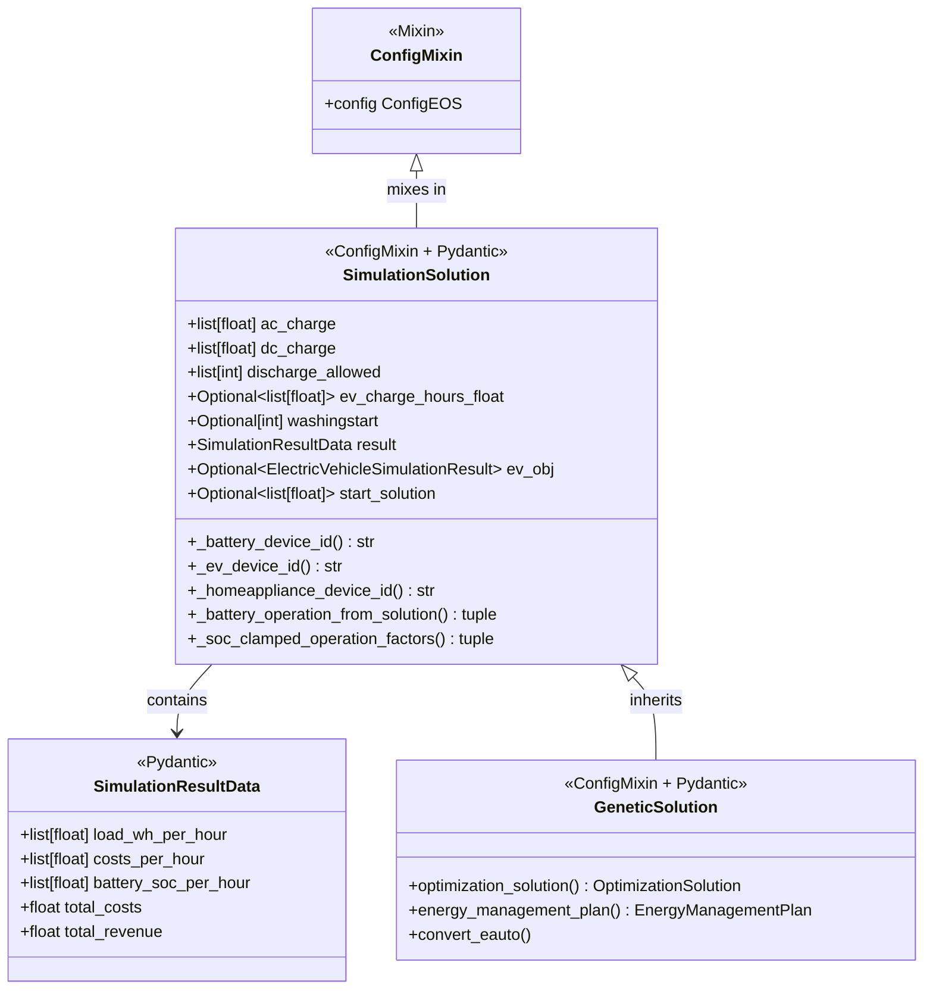

# Move Decision Variables and Helper Methods to simulation/solution.py

## Objective

Extract solver-agnostic decision variables and helper methods from [`GeneticSolution`](src/akkudoktoreos/optimization/genetic/geneticsolution.py:39) into a new base class in [`simulation/solution.py`](src/akkudoktoreos/optimization/simulation/solution.py), so that other solvers (DP, MPC, LP) can reuse them.

## Current Situation

### geneticsolution.py (697 lines)

The [`GeneticSolution`](src/akkudoktoreos/optimization/genetic/geneticsolution.py:39) class contains:

**Solver-agnostic elements (candidates for extraction):**
| Element | Type | Description |
|---------|------|-------------|
| `ac_charge` | `list[float]` | AC charging values as relative power (0.0-1.0) |
| `dc_charge` | `list[float]` | DC charging values as relative power (0-1) |
| `discharge_allowed` | `list[int]` | Discharge values (1 for discharge, 0 otherwise) |
| `ev_charge_hours_float` | `Optional[list[float]]` | EV charging values as relative power |
| `washingstart` | `Optional[int]` | Start time for washing appliance |
| `result` | `SimulationResultData` | Simulation result data |
| `ev_obj` | `Optional[ElectricVehicleSimulationResult]` | EV state after optimization |
| `start_solution` | `Optional[list[float]]` | Starting solution array |
| `_battery_device_id()` | Method | Gets battery device ID from config |
| `_ev_device_id()` | Method | Gets EV device ID from config |
| `_homeappliance_device_id()` | Method | Gets home appliance device ID from config |
| `_battery_operation_from_solution()` | Method | Maps solution to BatteryOperationMode |
| `_soc_clamped_operation_factors()` | Method | SOC-aware clamping using config |

**GA-specific elements (stay in geneticsolution.py):**
| Element | Type | Reason |
|---------|------|--------|
| `optimization_solution()` | Method | Produces `OptimizationSolution` DataFrame |
| `energy_management_plan()` | Method | Produces `EnergyManagementPlan` |
| `convert_eauto` validator | Validator | Converts `Battery` to `ElectricVehicleSimulationResult` |
| Computed fields (deprecated) | Computed fields | `eautocharge_hours_float`, `eauto_obj` |

### simulation/solution.py (245 lines)

Existing solver-agnostic classes:
- [`DeviceSimulationResult`](src/akkudoktoreos/optimization/simulation/solution.py:21) - base result for single device
- [`ElectricVehicleSimulationResult`](src/akkudoktoreos/optimization/simulation/solution.py:33) - EV charging behavior
- [`SimulationResultData`](src/akkudoktoreos/optimization/simulation/solution.py:80) - simulation output data

## Target Architecture

```
simulation/solution.py
├── DeviceSimulationResult              (existing, unchanged)
├── ElectricVehicleSimulationResult     (existing, unchanged)
├── SimulationResultData                (existing, unchanged)
└── SimulationSolution                  (NEW - base class with ConfigMixin)
    ├── Inherits ConfigMixin for self.config access
    ├── ac_charge: list[float]
    ├── dc_charge: list[float]
    ├── discharge_allowed: list[int]
    ├── ev_charge_hours_float: Optional[list[float]]
    ├── washingstart: Optional[int]
    ├── result: SimulationResultData
    ├── ev_obj: Optional[ElectricVehicleSimulationResult]
    ├── start_solution: Optional[list[float]]
    ├── numpy validators for list fields
    ├── _battery_device_id()
    ├── _ev_device_id()
    ├── _homeappliance_device_id()
    ├── _battery_operation_from_solution()
    └── _soc_clamped_operation_factors()

geneticsolution.py
└── GeneticSolution(SimulationSolution)  (inherits base, adds GA-specific)
    ├── optimization_solution()
    ├── energy_management_plan()
    ├── convert_eauto validator (Battery -> ElectricVehicleSimulationResult)
    └── computed fields (deprecated German names: eautocharge_hours_float, eauto_obj)
```

## Mermaid Diagram



## Detailed Steps

### Step 1: Create `SimulationSolution` base class in `simulation/solution.py`

Add a new class at the end of [`simulation/solution.py`](src/akkudoktoreos/optimization/simulation/solution.py):

```python
from akkudoktoreos.core.coreabc import ConfigMixin
from akkudoktoreos.devices.devicesabc import BatteryOperationMode

class SimulationSolution(ConfigMixin, SimulationParametersBaseModel):
    """Solver-agnostic simulation solution with decision variables.

    Base class holding decision variables and helper methods common across
    solvers (GA, DP, MPC, LP). Subclasses add solver-specific functionality.
    """

    model_config = ConfigDict(populate_by_name=True, extra="ignore")

    # --- Decision variables ---
    ac_charge: list[float] = Field(
        json_schema_extra={
            "description": "Array with AC charging values as relative power (0.0-1.0), other values set to 0."
        }
    )
    dc_charge: list[float] = Field(
        json_schema_extra={
            "description": "Array with DC charging values as relative power (0-1), other values set to 0."
        }
    )
    discharge_allowed: list[int] = Field(
        json_schema_extra={
            "description": "Array with discharge values (1 for discharge, 0 otherwise)."
        }
    )
    ev_charge_hours_float: Optional[list[float]] = Field(
        default=None,
        validation_alias=AliasChoices("ev_charge_hours_float", "eautocharge_hours_float"),
        json_schema_extra={
            "description": "Array with EV charging values as relative power (0.0-1.0), or null if no EV is optimized."
        },
    )
    washingstart: Optional[int] = Field(
        default=None,
        json_schema_extra={
            "description": "Start hour for home appliance (washing machine), or null if not applicable."
        },
    )
    result: SimulationResultData
    ev_obj: Optional[ElectricVehicleSimulationResult] = Field(
        default=None,
        validation_alias=AliasChoices("ev_obj", "eauto_obj"),
        json_schema_extra={"description": "Electric vehicle state after optimization."},
    )
    start_solution: Optional[list[float]] = Field(
        default=None,
        json_schema_extra={
            "description": "Array of binary values (0 or 1) representing a possible starting solution."
        },
    )

    @field_validator(
        "ac_charge",
        "dc_charge",
        "discharge_allowed",
        "ev_charge_hours_float",
        "start_solution",
        mode="before",
    )
    @classmethod
    def convert_numpy(cls, field: Any) -> Any:
        return NumpyEncoder.convert_numpy(field)[0]

    # --- Helper methods ---
    def _battery_device_id(self) -> str:
        """Get battery device id."""
        try:
            return self.config.devices.batteries[0].device_id
        except Exception:
            return "battery1"

    def _ev_device_id(self) -> str:
        """Get electric vehicle device id."""
        try:
            return self.config.devices.electric_vehicles[0].device_id
        except Exception:
            return "ev1"

    def _homeappliance_device_id(self) -> str:
        """Get home appliance device id."""
        try:
            return self.config.devices.home_appliances[0].device_id
        except Exception:
            return "homeappliance1"

    def _battery_operation_from_solution(
        self,
        ac_charge: float,
        dc_charge: float,
        discharge_allowed: bool,
    ) -> tuple[BatteryOperationMode, float]:
        """Maps low-level solution to a representative operation mode and factor.
        ... (copy docstring and logic from Geneticsolution)
        """
        ...

    def _soc_clamped_operation_factors(
        self,
        ac_charge: float,
        dc_charge: float,
        discharge_allowed: bool,
        soc_pct: float,
    ) -> tuple[float, float, bool]:
        """Clamp raw genetic gene values by the battery's actual SOC at that hour.
        ... (copy docstring and logic from Geneticsolution)
        """
        ...
```

**Key design decisions:**
- Inherits from `ConfigMixin` for `self.config` access (needed by helper methods)
- Inherits from `SimulationParametersBaseModel` to match existing pattern
- Uses `extra="ignore"` in `model_config` for forward compatibility
- Includes `default=None` for optional fields
- Keeps `validation_alias` for backward compatibility
- All helper methods are pure logic (no GA-specific code)

### Step 2: Refactor `GeneticSolution` to inherit from `SimulationSolution`

Modify [`geneticsolution.py`](src/akkudoktoreos/optimization/genetic/geneticsolution.py):

1. **Change inheritance:** `class GeneticSolution(ConfigMixin, SimulationSolution)`
   - Note: `ConfigMixin` is now inherited from `SimulationSolution`, but explicit inheritance is fine in Python

2. **Remove duplicated elements:**
   - Field definitions: `ac_charge`, `dc_charge`, `discharge_allowed`, `ev_charge_hours_float`, `washingstart`, `result`, `ev_obj`, `start_solution`
   - NumPy validator for these fields
   - Helper methods: `_battery_device_id()`, `_ev_device_id()`, `_homeappliance_device_id()`, `_battery_operation_from_solution()`, `_soc_clamped_operation_factors()`

3. **Keep GA-specific elements:**
   - `optimization_solution()` - produces `OptimizationSolution` DataFrame
   - `energy_management_plan()` - produces `EnergyManagementPlan`
   - `convert_eauto` validator - converts `Battery` to `ElectricVehicleSimulationResult`
   - Computed fields for deprecated names (`eautocharge_hours_float`, `eauto_obj`)

4. **Update imports:**
   - Import `SimulationSolution` from `simulation/solution.py`
   - Remove imports no longer needed locally

### Step 3: Update imports in `simulation/__init__.py`

Add to [`simulation/__init__.py`](src/akkudoktoreos/optimization/simulation/__init__.py):

```python
from akkudoktoreos.optimization.simulation.solution import SimulationSolution

__all__ = [
    # ... existing exports ...
    # Solution
    "SimulationSolution",
]
```

### Step 4: Update imports in dependent files

| File | Change |
|------|--------|
| [`src/akkudoktoreos/optimization/genetic/geneticsolution.py`](src/akkudoktoreos/optimization/genetic/geneticsolution.py:30) | Import `SimulationSolution` from `simulation/solution.py` |
| [`src/akkudoktoreos/optimization/genetic/genetic.py`](src/akkudoktoreos/optimization/genetic/genetic.py:26) | No change (still imports `GeneticSolution`) |
| [`src/akkudoktoreos/server/eos.py`](src/akkudoktoreos/server/eos.py:54) | No change (still imports `GeneticSolution`) |
| [`src/akkudoktoreos/core/ems.py`](src/akkudoktoreos/core/ems.py:24) | No change (still imports `GeneticSolution`) |
| [`tests/test_geneticoptimize.py`](tests/test_geneticoptimize.py:15) | No change (still imports `GeneticSolution`) |

### Step 5: Run tests

```bash
poetry run pytest tests/test_geneticoptimize.py tests/test_genetic_encoding.py tests/test_geneticsimulation.py tests/test_geneticsimulation2.py -v
```

### Step 6: Run full test suite

```bash
poetry run pytest tests/ -v
```

## Risks and Mitigations

| Risk | Impact | Mitigation |
|------|--------|------------|
| Pydantic inheritance with `ConfigMixin` | Medium | `ConfigMixin` is a simple mixin with `@classproperty`; `GeneticSolution` already uses this pattern |
| Breaking JSON serialization | High | Keep `validation_alias` and computed fields for backward compat |
| Circular imports | Medium | `simulation/solution.py` imports `ConfigMixin` from `core/coreabc.py` which has no dependency on simulation |
| Test fixtures break | Low | Run tests after each step |

## Backward Compatibility

- The `GeneticSolution` class keeps the same external API
- JSON deserialization remains compatible (same field names, aliases)
- Computed fields for deprecated German names stay in `GeneticSolution`
- Consumers (`eos.py`, `ems.py`, tests) do not need to change imports
